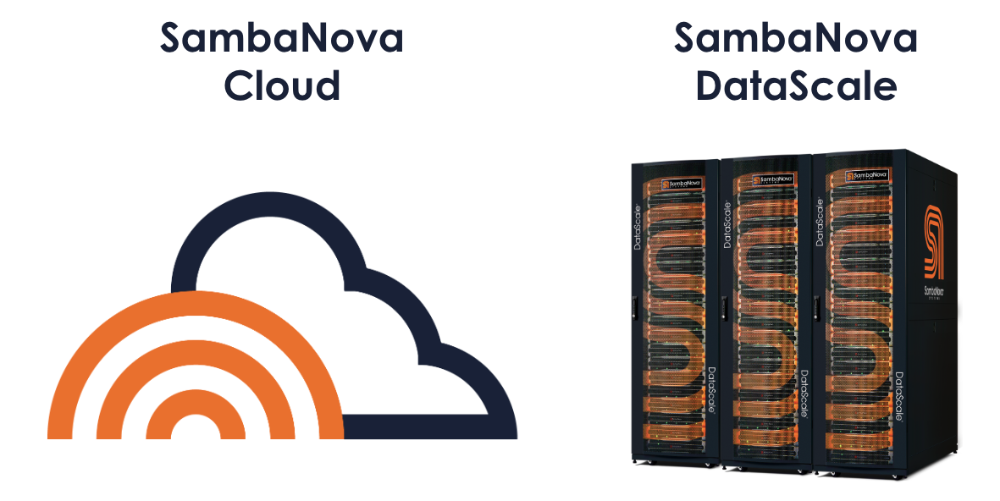

# Hands-on with SambaNova Systems 

This hands-on session is divided into two parts: 

* [AI inference using the SambaNova Cloud](./inference/)
* [AI training on the SambaNova DataScale SN30 at the ALCF AI testbed](./training/)
