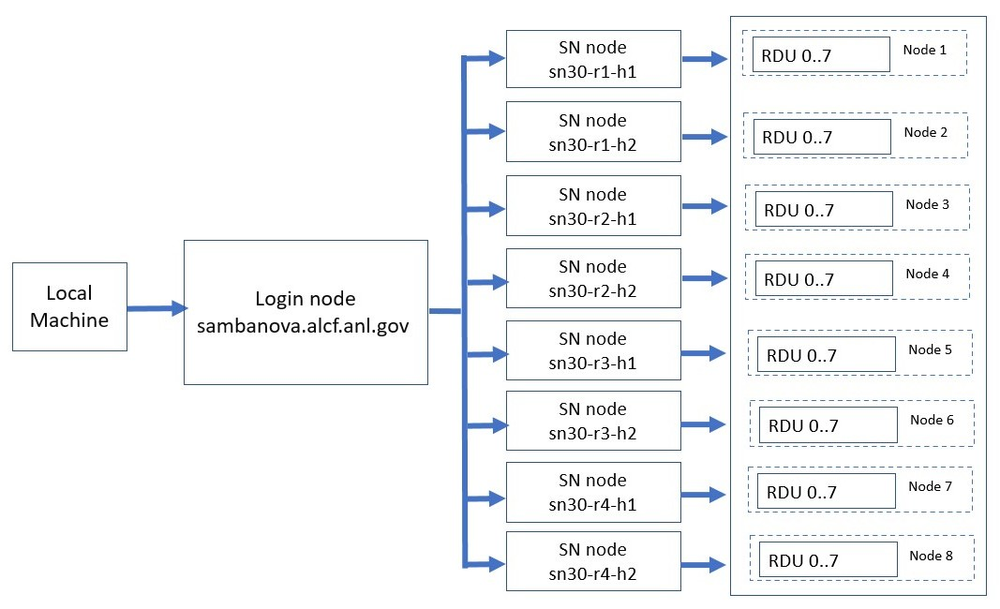

# Training on the SambaNova DataScale SN30 

The SambaNova DataScale is a fully-integrated hardware-software AI system for model training, fine-tuning, and inference. 

## Connection to SambaNova 

Connection to a SambaNova node is a two-step process. The first step is to ssh to the login node. The second step is to log in to a SambaNova node from the login node.



### Log in to Login Node

Log in to the SambaNova login node from your local machine. This uses the **MobilePASS+** token generated every time you log in to the system. 

In the example below, replace ALCFUserID with your ALCF user id.
```bash
ssh ALCFUserID@sambanova.alcf.anl.gov
Password: < MobilePASS+ code >
```

### Log in to a SambaNova Node

Once you are on the login node, ssh to one of the SambaNova nodes. For example:

```bash
ssh sn30-r1-h1       
```

You can also ssh to `sn30-r1-h2`, `sn30-r2-h1`, `sn30-r2-h2`, `sn30-r3-h1`, `sn30-r3-h2`, `sn30-r4-h1`, `sn30-r4-h2`.

## SambaNova Example Programs

Use the examples of well-known AI applications under the path: `/opt/sambaflow/apps`, on all SambaNova compute nodes. 

Make a copy of this to your home directory:

```bash
cp -r /opt/sambaflow/apps/ ~
```

## Virtual Environments 

SambaNova software stack and associated environmental variables are setup at login. 

Each of the samples or application examples provided by SambaNova has its own pre-built virtual environment which can be readily used. They are present in the `/opt/sambaflow/apps/` directory tree within each of the applications. 

## Hands-on Session Example 

* [GPT](./gpt.md)
* [Llama 2 7B ModelBox](./llama7b_modelbox.md)

## Next Steps 

Try additional examples.

* [LeNet](./lenet.md)

# Useful Resources 

* [ALCF SambaNova documentation](https://docs.alcf.anl.gov/ai-testbed/sambanova/getting-started/)
* [SambaNova documentation](https://docs.sambanova.ai/developer/latest/sambaflow-intro.html) 
* SambaNova applications path: `/opt/sambaflow/apps/`
* SambaNova model scripts: `/data/ANL/scripts/`
* Important datasets: `/software/sambanova/dataset/`
